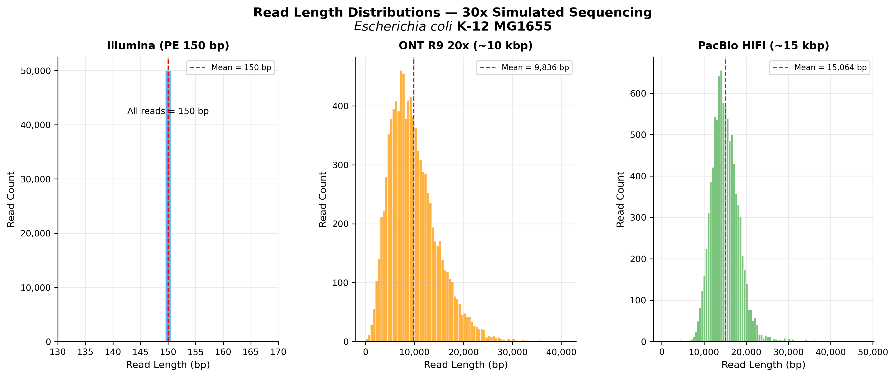
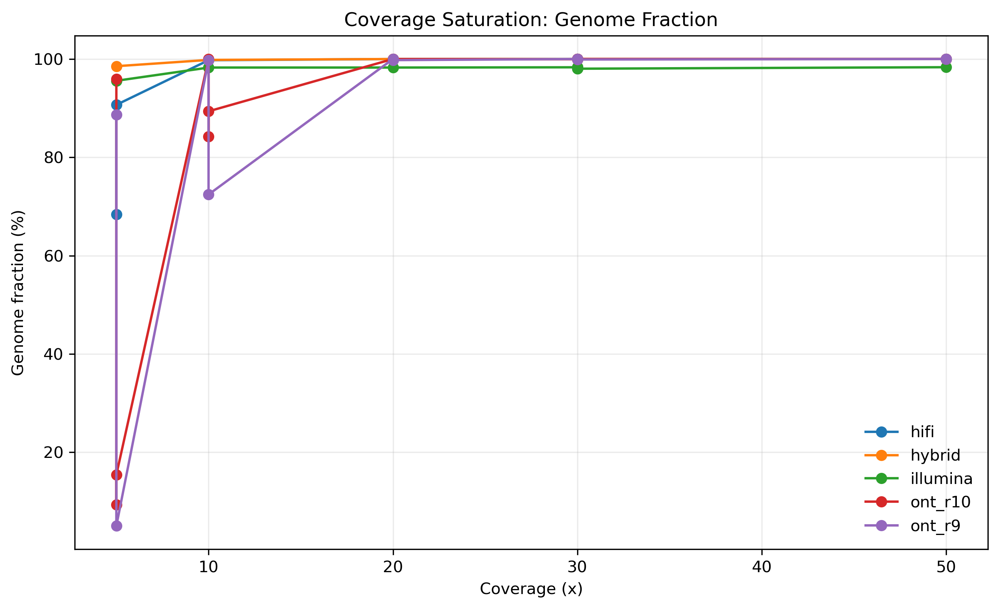
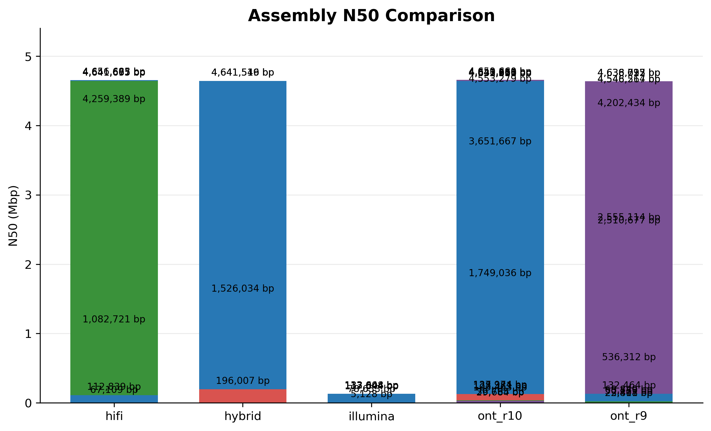
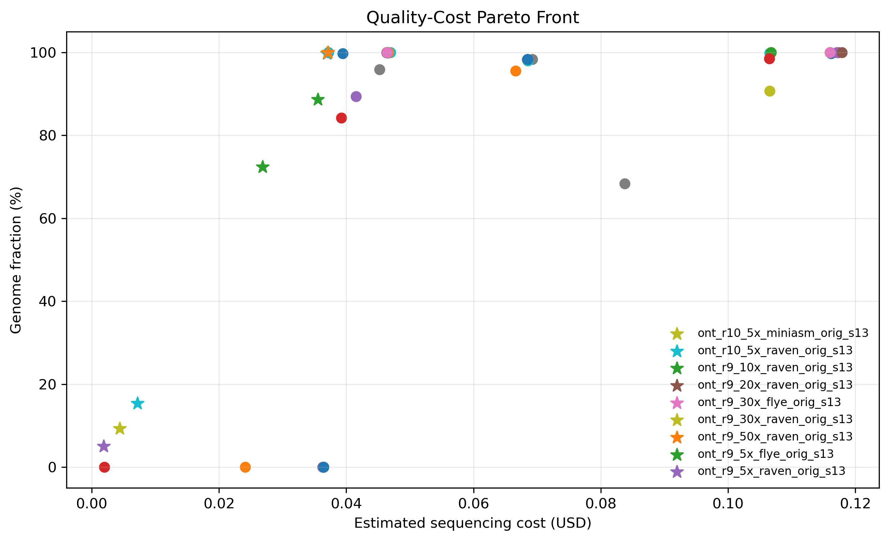
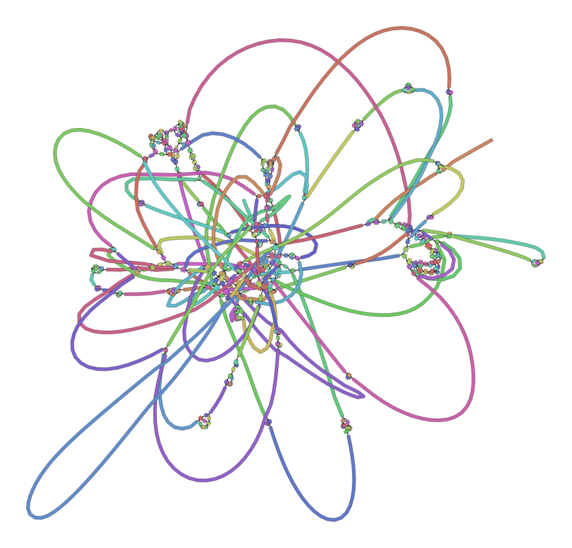
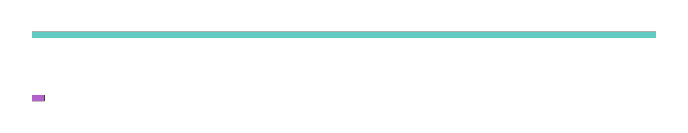
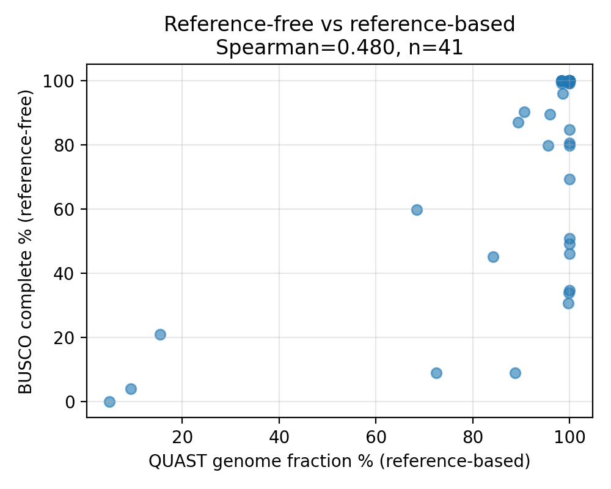
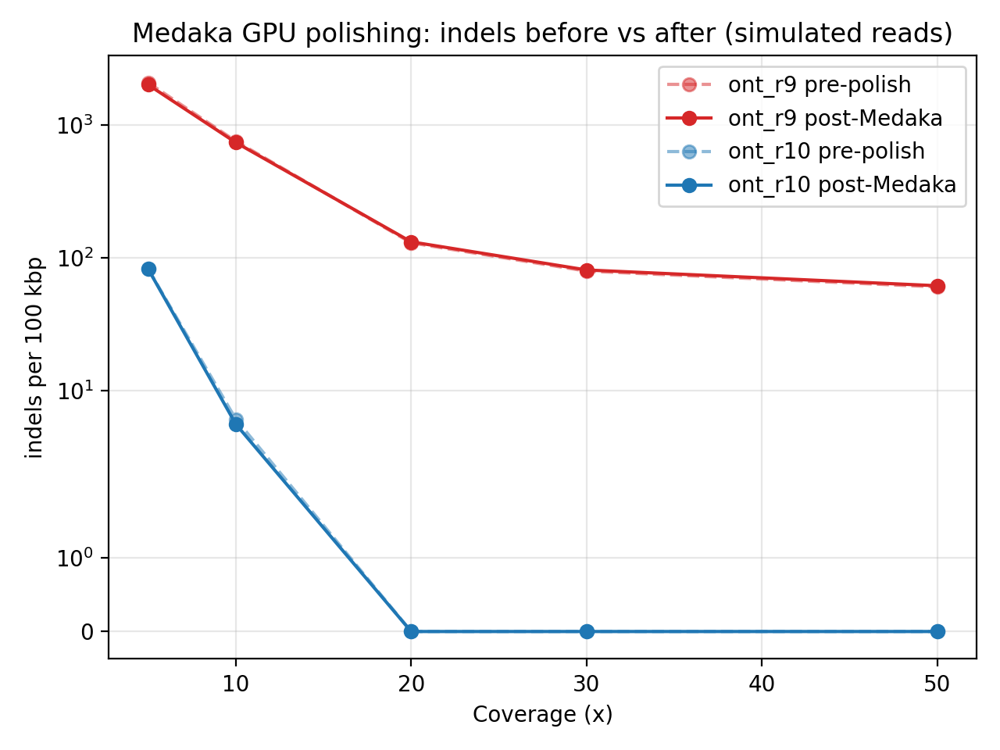

# 基于模拟 Reads 的二代与三代测序技术组装性能基准构建与比较

**面向低算力场景的多代测序技术比较与小型基因组组装质量评估 · 课程报告**

> 本文件夹（`results/`）即完整交付：`课程报告.md`（本文）、`论文_ECCV2026.pdf`（英文论文）、`答辩PPT大纲.md`、`答辩讲稿.md`、`figures/`（全部图）、`tables/`（全部结果表）。

---

## 摘要

在固定预算与普通算力下选择测序策略，是基因组学中反复出现的决策问题；但已有比较大多把"**测序技术**"与"**组装算法**"混在一起，且只报告单一深度。本项目构建了一个**配置驱动、可一键复现**的基准，把这两个因素解耦。以大肠杆菌 *E. coli* K-12 MG1655（4.64 Mbp）为参考，模拟四类 reads——Illumina PE150、Oxford Nanopore R9（≈90%）与 R10（≈99%）、PacBio HiFi——覆盖 5–50× 五档深度，并分别用六种组装器（SPAdes、Flye、Raven、miniasm、hifiasm、Unicycler）组装，得到 **55 个真实组装**，用有参（QUAST）与无参（BUSCO）指标并结合时间/内存评估。主要发现：(1) 短读长**永远拼不成完整基因组**（50× 仍 ≥80 contigs），长读长在 **20× 的"最小够用覆盖度"**就拼成单条；(2) **组装器解释的质量方差与技术几乎相等**（0.25 vs 0.24）；(3) 成本–质量–算力 Pareto 在所有预算下都选出 **ONT R10 @ 20×（US$0.92）**；(4) 神经抛光（Medaka）与 k-mer QV（Merqury）在模拟 reads 上**因同一根因失效**，揭示了模拟基准的局限。

---

## 1. 引言

De novo 基因组组装把测序 reads 拼回基因组，结果质量同时取决于 **reads**（长度、错误率、深度）与**组装器**（de Bruijn 图 vs 重叠图）。预算有限、只有普通工作站的使用者必须决定：**选哪种测序技术、测多深、用哪个组装器**——这往往凭经验而非受控比较。已有比较通常 (a) 只报一个覆盖度，(b) 每种技术绑定一个组装器、把技术与工具效应混淆，(c) 只看连续性、忽略成本与算力。我们像做机器学习 benchmark 一样设计本项目：一个标准答案、多种输入、统一评估、受控因子扫描。

**创新点**：① 配置驱动、固定种子的 55 组装基准（技术/覆盖度/组装器/难度四正交轴，可一键复现）；② 技术 vs 工具方差归因；③ 成本–质量–算力 Pareto + 最小够用覆盖度；④ 重复/质粒压力测试 + 无参评估审计 + GPU 抛光在模拟数据上失效的诚实分析。

---

## 2. 背景与相关工作

- **读长模拟**：ART 模拟 Illumina；Badread 模拟可调长度/准确率的长读长，使我们能构造 R9/R10/HiFi 三个"技术代次"。
- **组装器**：短读长用 de Bruijn 图（SPAdes）；长读长用重叠/repeat-graph（miniasm、Raven、Flye）；HiFi 用 hifiasm；混合用 Unicycler。
- **评估**：QUAST（有参）、BUSCO 与 Merqury（无参）、Medaka（ONT 神经抛光）。
与以往单点比较不同，我们把技术与工具作为可分离因子，并加入资源/成本维度。

---

## 3. 实验设计

**参考与难点**：基准参考 *E. coli* K-12 MG1655（4.64 Mbp）；构造三个合成变体 `rep_v1`（长串联重复）、`rep_v2`（散在重复）、`plasmid`（50 kbp 质粒）以考察重复分辨率与质粒回收。

**读长模拟**：四技术 × 五深度，固定种子。准确率档位编码代次：ONT R9（≈87–90%）、R10（≈99%）、HiFi（≈99.9%）。

**矩阵（55 = L1 主网格 46 + L3 难点 9）**

| 轴 | 取值 | 数 |
|---|---|---|
| 技术 | Illumina, ONT R9, ONT R10, HiFi(+hybrid) | 4(+1) |
| 覆盖度 | 5,10,20,30,50× | 5 |
| 组装器 | SPAdes, Flye, Raven, miniasm, hifiasm, Unicycler | 6 |
| 参考 | base, rep_v1, rep_v2, plasmid | 4 |

每个组装用 QUAST（对应参考）+ BUSCO（`bacteria_odb10`，无参）评估，并记录峰值内存与墙钟时间；成本模型按 $/Gb × 深度估算测序成本。

---

## 4. 实验结果

### 4.1 连续性 vs 覆盖度：最小够用覆盖度

| 覆盖度 | Illumina | ONT R9 | ONT R10 | HiFi | Hybrid |
|---:|---:|---:|---:|---:|---:|
| 5  | 1296 | 43 | 48 | 46 | 59 |
| 10 | 129  | 19 | 8  | 6  | 7 |
| 20 | 89   | 2  | **1** | **1** | **1** |
| 30 | 82   | 2  | 2  | **1** | **1** |
| 50 | 87   | 2  | **1** | **1** | **1** |

短读长稳定在 ~80 contigs、**50× 仍不闭合**；长读长在 **20×** 拼成单条 → **最小够用覆盖度 = 20×**。

### 4.2 技术 vs 工具：方差归因
对 L1 矩阵 N50 的组间方差占比：**技术 0.239、组装器 0.249，几乎相等**。低深度尤为明显：ONT R10 @ 10× 用 Flye 得 8 contigs，Raven/miniasm 为 44/51。**工具的影响可超过一个覆盖度档**——只说技术、不说组装器是不充分的。

### 4.3 代次效应 R9 → R10
固定读长只变准确率：ONT R10 在 20× 单条、indel 近零；R9 在 30× 仍停两条且 indel 高得多（30× 时 79.7 vs 0.0 /100kbp）。现代 ONT 已追平 HiFi 大半。

### 4.4 成本–质量–算力 Pareto
达到 ≥99% genome fraction 且单 contig 的**预算最优配置是 ONT R10 @ 20× + Flye，估算 US$0.92**，且在 US$1–20 预算下都最优（过拐点再花钱不提质）。组装算力很小（41 个组装合计约 31 分钟），瓶颈是测序成本而非组装。

### 4.5 重复/质粒压力测试（L3，30×）

| 参考 | Illumina(SPAdes) | ONT R10(Flye) | HiFi(hifiasm) |
|---|---|---|---|
| rep_v1 | 87 / 98.0% | 2 / 99.9% | 2 / 100% |
| rep_v2 | 91 / 98.0% | 1 / 100% | 3 / 100% |
| plasmid | 83 / 98.3% | 2 / 100% | 2 / 100% |

（contigs / genome fraction）短读长仍 80+ contigs；长读长恢复到 1–3 contigs、近 100%。**组装图直观解释机制**——短读长缠成一团、长读长近线性：

### 4.6 无参评估与可信度审计
BUSCO 对全部 55 个组装可得，但**秩相关审计**显示它与有参质量仅中度一致（Spearman ρ=0.48 对 genome fraction、0.57 对 N50）。因为细菌上 BUSCO 很快饱和到 100%，所以它能**剔除差组装、却难区分好组装**——是有用的筛子，不能替代有参/结构指标。

### 4.7 GPU 神经抛光：一个模拟局限（诚实结论）
对所有 ONT Flye 组装用 GPU（RTX 4090）跑 Medaka 抛光。与"抛光闭合 ONT→HiFi 差距"的常识相反，在**模拟 reads** 上几乎无改善、R9 的 mismatch 略**变差**（30× 时 16.8→26.7 /100kbp）。原因：Medaka 学的是**真实 ONT 信号**的错误分布，与模拟器不同；自带 R10 模型套到 R9 也失配。**独立地**，Merqury QV 因模拟 reads 退化 k-mer 谱而无法计算。两个真实数据工具同因失效，是一个可推广的警示：**仅靠模拟的基准无法评估"从真实测序噪声中学习"的方法**。

### 4.8 下游基因恢复："高 N50 ≠ 能用"

| 组装 | contigs | CDS | rRNA | tRNA |
|---|---:|---:|---:|---:|
| 参考(真值) | 1 | 4305 | 22 | 88 |
| HiFi (hifiasm) | 1 | 4302 | 22 | 88 |
| ONT R10 (Flye) | 2 | 4310 | 22 | 88 |
| Hybrid (Unicycler) | 1 | 4305 | 22 | 88 |
| Illumina (SPAdes) | 139 | 4235 | **14** | 83 |

碎成 139 段的短读长组装只恢复 **14/22 个 rRNA**——rRNA 操纵子是重复，短读长把它们坍缩，**碎片化直接删掉了重要基因**。连续性直接传导到下游可用性。

---

## 5. 讨论与局限
本研究限定单一小基因组与**模拟** reads——换来可复现与低成本，但限制外部效度。4.7 节正是模拟失效之处，指明最清晰的未来工作：**在公共库的真实 ONT/HiFi 数据上验证**。其他扩展：更多高重复基因组、多种子置信区间、在基准表上训练推荐模型。

---

## 6. 结论与建议
短读长无法闭合基因组；长读长从 **20× 最小够用覆盖度**起即可闭合；组装器解释的方差与技术相当；成本感知的 Pareto 推荐 **ONT R10 @ 20×**。通过**如实报告**神经抛光与 QV 在模拟数据上的失效，我们为依赖模拟的基准提供了可复用的警示。

**实用建议**：低成本闭合小型细菌基因组优先 **ONT R10 @ 20× + Flye**；预算更紧可用 ONT R10 接受略碎；需最高碱基准确率且预算允许用 HiFi；纯短读长不适合需要完整基因（尤其 rRNA）的下游分析。

---

## 7. 四人分工
- **A — 数据与模拟矩阵**：参考与三个合成变体、四技术×五覆盖度读长模拟、reads 统计。
- **B — 组装与工具解耦**：六组装器矩阵、资源记录、Bandage 组装图。
- **C — 评估与分析**：QUAST+BUSCO、Pareto/最小覆盖度/方差归因/重复·质粒/无参审计、全部图表。
- **D — 工程化与 GPU**：micromamba 环境、Medaka GPU 抛光、Prokka 下游、可复现 harness、成本模型、论文/报告统稿。

---

## 附：结果文件索引（均在本 `results/` 下）
- **表** `tables/`：`assembly_metrics.csv`(55 行主表)、`polish_quality.csv`、`l3_reference_stress_summary.csv`、`downstream_metrics.csv`、`reference_free_audit.csv`、`recommendation_by_budget.csv` 等。
- **图** `figures/`：饱和曲线、Pareto、抛光对比、无参审计、组装图（短读缠绕 vs 长读线性）、N50/contig/genome-fraction/error 对比、读长分布。
- **论文** `论文_ECCV2026.pdf`（源码 `论文源码_main.tex`）；**答辩** `答辩PPT大纲.md`、`答辩讲稿.md`。
